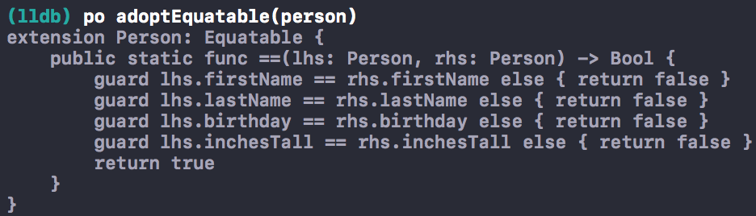

# Equatable code generator
Suppose you have a struct in your Swift app like this:
```swift
struct Person {
    let firstName: String
    let lastName: String
    let birthday: Date
    let inchesTall: Int
}
```
In order to allow `Person` instances to be compared for equality, using the `==` operator, the struct must adopt Swift's `Equatable` protocol. 
```swift
// This doesn't work unless Person adopts the Equatable protocol.
let areSamePerson = (person1 == person2)
```
Writing code to check if two things are the same is boring, so make your computer do it!
```swift
// The values passed in here don't really matter.
let person = Person(firstName: "Clown", lastName: "Baby", birthday: Date(), inchesTall: 18)

// This prints Equatable code for the Person struct.
adoptEquatable(person)
```
The `adoptEquatable` function prints this to the console in Xcode…
```swift
extension Person: Equatable {
    public static func ==(lhs: Person, rhs: Person) -> Bool {
        guard lhs.firstName == rhs.firstName else { return false }
        guard lhs.lastName == rhs.lastName else { return false }
        guard lhs.birthday == rhs.birthday else { return false }
        guard lhs.inchesTall == rhs.inchesTall else { return false }
        return true
    }
}
```
Simply copy that code, paste it into your project, and you're done. 🙌

## Use it while debugging
Once you've added `adoptEquatable` to your project you can also call it while debugging, via the `po` command.



That's handy!

## Show me the code
Feel free to copy this function into your project and start using it.
```swift
import Foundation

// Generates code for a class or struct instance to conform to the Equatable protocol.
public func adoptEquatable(_ subject: Any) {
    let mirror = Mirror(reflecting: subject)
    
    let typeName: String = {
        let fullTypeName = String(reflecting: mirror.subjectType)
        let typeNameParts = fullTypeName.components(separatedBy: ".")
        let hasModulePrefix = typeNameParts.count > 1
        return hasModulePrefix
            ? typeNameParts.dropFirst().joined(separator: ".")
            : fullTypeName
    }()
    
    let propertyNames = mirror.children.map { $0.label ?? "" }
    
    // Associate an indentation level with each snippet of code.
    typealias TemplateGroup = [(Int, String)]
    let templateGroups: [TemplateGroup] = [
        [(0, "extension \(typeName): Equatable {")],
        [(1, "public static func ==(lhs: \(typeName), rhs: \(typeName)) -> Bool {")],
        propertyNames.map { (2, "guard lhs.\($0) == rhs.\($0) else { return false }") },
        [(2, "return true")],
        [(1, "}")],
        [(0, "}")]
    ]
    
    // Apply indentation to each line of code while flattening the list.
    let indent = "    "
    let linesOfCode = templateGroups.flatMap { templateGroup -> [String] in
        return templateGroup.map { (indentLevel: Int, code: String) -> String in
            let indentation = String(repeating: indent, count: indentLevel)
            return "\(indentation)\(code)"
        }
    }
    
    let sourceCode = linesOfCode.joined(separator: "\n")
    print(sourceCode)
}
```
This repository also includes an Xcode playground if you want to experiment.
